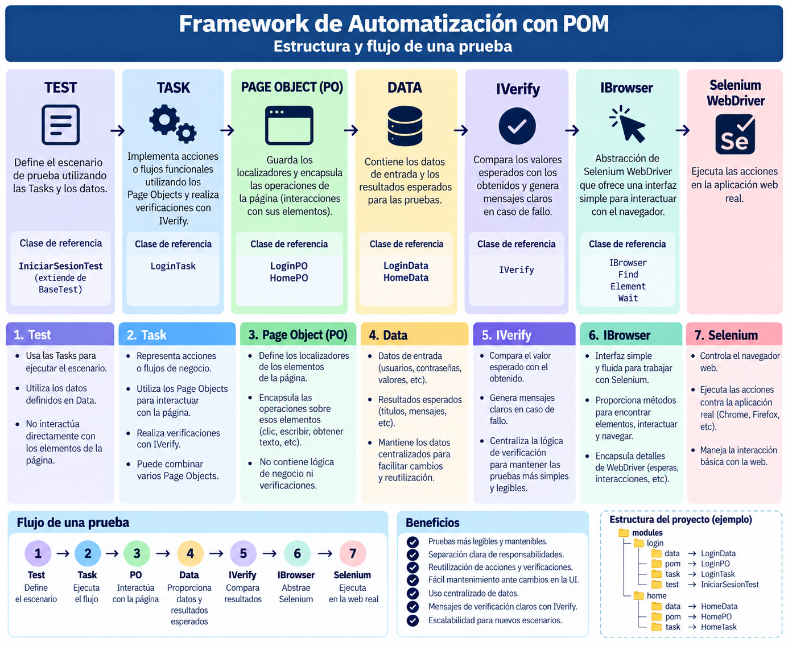

# Estructura del proyecto



# Parametrización (actividad "Parametrizar pruebas")

Se analizaron las pruebas existentes (`LoginTest` sobre Swag Labs) y se separaron los datos así:

## Configuración y entorno → `src/main/resources/config.properties`

Se leen con `ConfigReader` (que permite sobreescribir con `-Dclave=valor`).

| Clave | Antes | Ahora |
|-------|-------|-------|
| `swaglabs.url` | fija en `BaseTest` | `config.properties` |
| `swaglabs.login.title` | constante en `LoginData` | `config.properties` |
| `swaglabs.home.title` | constante en `HomeData` | `config.properties` |
| `browserfactory.*`, `drivermanager.*`, `find.*` | ya estaban en `config.properties` | sin cambios |

## Datos de prueba → `src/test/resources/datos/*.csv`

Se leen con `@ParameterizedTest` + `@CsvFileSource`; cada fila es una ejecución.

| Archivo | Prueba | Columnas |
|---------|--------|----------|
| `login_validos.csv` | `iniciarSesionCorrectoTest` | `usuario`, `clave` |
| `login_invalidos.csv` | `iniciarSesionIncorrectoTest` | `usuario`, `clave`, `mensajeError` |

`BaseTest` ya no tiene usuario ni contraseña fijos. Para el caso negativo se agregaron
`LoginPO.getErrorMessage()` y `LoginTask.logInWithInvalidCredentialsAndVerify(...)`.

Además, `ChromeDriver` desactiva el gestor de contraseñas de Chrome: al reutilizar el navegador
entre filas, su aviso de contraseña filtrada interceptaba el clic del login siguiente.

## Ejecución

```bash
cd automation-framework
mvn test
mvn test -Dswaglabs.url=https://www.saucedemo.com/   # ejemplo de override
```
